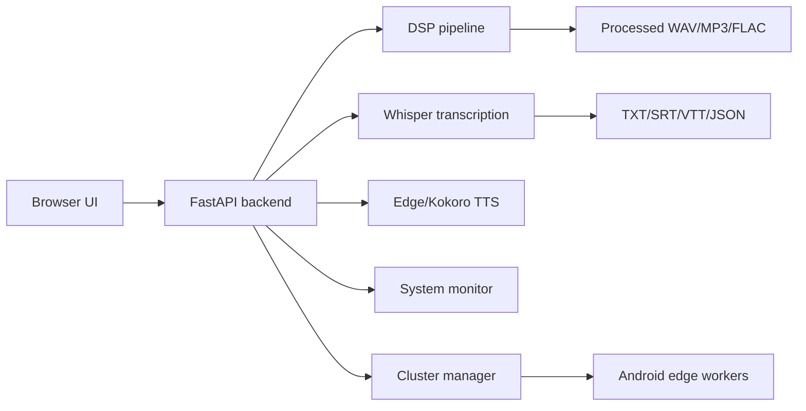

<div align="center">

# AudioEnhancerMAX

### The open-source AI audio media center

**Professional audio enhancement, transcription, TTS, monitoring, and edge processing.**<br>
**16+ processing modules · Apple Silicon acceleration · local Ollama/Gemma smart mode · Android edge workers · local-first core · v3.5.1**

[](LICENSE)
[](https://python.org)
[](https://fastapi.tiangolo.com)
[](#)
[](https://sourceforge.net/projects/audioenhancermax/)

[Official Website](https://fabriziodegni.com/AudioEnhancerMAX/) ·
[SourceForge](https://sourceforge.net/projects/audioenhancermax/) ·
[Documentation](#documentation) ·
[Changelog](CHANGELOG.md) ·
[Contributing](CONTRIBUTING.md)


AudioEnhancerMAX turns raw recordings into cleaner, production-ready audio without requiring a cloud service for the core processing pipeline.

</div>

---

## Why It Exists

AudioEnhancerMAX is built for creators, podcasters, researchers, interviewers, and audio-heavy workflows where privacy, control, and auditability matter. It combines local DSP, AI-assisted decisions, real-time monitoring, transcription, text-to-speech, and optional Android edge workers in one FastAPI + vanilla JS application.

The default architecture is local-first: uploads, DSP output, timing history, and local model inference stay on the host machine unless you explicitly enable an integration that sends data elsewhere. You decide when to use local AI through Ollama/Gemma, when to offload DSP chunks to trusted devices on your LAN, and which output format to export.

AudioEnhancerMAX has also been recognized with the **SourceForge Rising Star Award** for open-source traction and community engagement.

## Highlights

| Area | What You Get |
| --- | --- |
| Audio cleanup | DeepFilterNet/noisereduce fallback, wind, buzz, static, reverb/echo, breath, mouth-click and silence handling |
| Speech editing | Whisper-based filler word, hesitation, and stutter cleanup with natural crossfades |
| Enhancement | Studio sound chain, Auto EQ, LUFS normalization, super-resolution, Demucs music preservation |
| AI workflow | Smart mode, content classification, dynamic filter tuning, editing suggestions through local Ollama/Gemma |
| Transcription | Faster-Whisper, streaming SSE delivery, TXT/SRT/VTT/JSON export, crash-resilient partial saves |
| TTS | Local Kokoro voices, optional Edge Neural voices, expressive rewrite mode, voice-clone input hook |
| Monitoring | CPU/GPU/ANE/RAM/power/thermal dashboard with adaptive ETA and per-step timing history |
| Edge compute | Android Kotlin worker app with HTTP processing and UDP discovery on trusted LANs |

## Quick Start

### Requirements

- Python 3.10+
- FFmpeg
- macOS Apple Silicon recommended, with Linux/Windows support for core local processing
- Ollama + Gemma model optional for Smart Mode and expressive rewrite
- Android Studio/JDK 17 or 21 optional for building the Android worker

### Install

```bash
git clone https://github.com/sev7enITA/AudioEnhancerMAX.git
cd AudioEnhancerMAX

python3 -m venv venv
source venv/bin/activate
pip install --upgrade pip
pip install -r requirements.txt
```

### Run Locally

```bash
python -m uvicorn app.main:app --host 127.0.0.1 --port 8000 --reload
```

Open [http://127.0.0.1:8000](http://127.0.0.1:8000).

For LAN testing, bind explicitly and restrict browser origins:

```bash
export AEMAX_CORS_ORIGINS="http://192.168.1.20:8000,http://localhost:8000"
python -m uvicorn app.main:app --host 0.0.0.0 --port 8000
```

## Optional AI Setup

```bash
brew install ffmpeg
brew install ollama
ollama pull gemma4:e2b
```

`gemma4:e2b` is the preferred model name when available; the app also auto-detects other local Gemma-family models exposed by Ollama. If Gemma is not available, Smart Mode falls back to deterministic heuristics and the core DSP pipeline still works.

## Android Edge Worker

The native Android worker lives in [android-worker](android-worker/). It exposes a small HTTP service on port `8877` and advertises itself to the master over UDP on trusted local networks.

```bash
cd android-worker
export JAVA_HOME="/path/to/jdk17-or-jdk21"
./gradlew assembleDebug
```

Prebuilt debug APKs are stored in [releases](releases/).

## Architecture



## Transparency and AI Governance

AudioEnhancerMAX should be evaluated as a **local-first, AI-assisted tool**, not as a black-box autonomous audio editor. Processing choices remain visible in the UI, source audio is preserved, and optional external services are documented.

| Component | Data Flow | Governance Note |
| --- | --- | --- |
| Uploads and processed audio | Stored locally under `app/uploads/` and `app/outputs/` | Original files are not modified by the pipeline. |
| DSP filters | Run locally in Python, or on explicitly trusted LAN workers | Output quality depends on source material and selected settings. |
| Faster-Whisper transcription | Runs locally when dependencies and models are installed | Transcript accuracy must be reviewed for high-stakes use. |
| Ollama/Gemma smart mode | Runs locally through Ollama when configured | Suggestions and dynamic tuning are assistive; they should not be treated as authoritative labels. |
| Kokoro TTS | Runs locally when installed | Local model availability depends on installed packages and voice assets. |
| Edge Neural TTS | Optional external service | Text is sent to Microsoft Edge TTS when this engine is selected. |
| Android edge workers | Audio chunks are sent over trusted LAN | Use only with devices you control and networks you trust. |
| SourceForge badge | Browser loads SourceForge badge script on public pages | This is presentation metadata, not part of the audio pipeline. |

For governance-sensitive workflows, keep the original audio, record the selected preset/options, review AI-generated transcripts, and document any external engine used for TTS or distribution.

## Security Posture

AudioEnhancerMAX is local-first software. By default, the server is documented for `127.0.0.1`, CORS is restricted to local origins, and user-controlled file IDs, download formats, versions, and preset IDs are validated before touching local storage.

Do not expose the FastAPI server directly to the public internet without adding authentication, rate limiting, storage quotas, and a reverse proxy policy.

## Documentation

- [Getting Started](docs/getting-started.md)
- [Feature Guide](docs/features.md)
- [API Reference](docs/api.md)
- [Edge Computing Setup](docs/edge-computing.md)
- [Developer Onboarding](docs/developer-onboarding.md)
- [AI Governance Notes](docs/ai-governance.md)
- [Troubleshooting / FAQ](docs/faq.md)
- [Translation Notes](docs/translation.md)

## Development Checks

```bash
source venv/bin/activate
python -m compileall -q app
pip install -r requirements-dev.txt
ruff check app
bandit -r app
```

## Project Links

- GitHub: [sev7enITA/AudioEnhancerMAX](https://github.com/sev7enITA/AudioEnhancerMAX)
- Official website: [fabriziodegni.com/AudioEnhancerMAX](https://fabriziodegni.com/AudioEnhancerMAX/)
- SourceForge: [sourceforge.net/projects/audioenhancermax](https://sourceforge.net/projects/audioenhancermax/)

## License

AudioEnhancerMAX is released under the [MIT License](LICENSE).

---

<div align="center">

**AudioEnhancerMAX by Fd**<br>
The local-first audio media center for the AI era.

</div>
